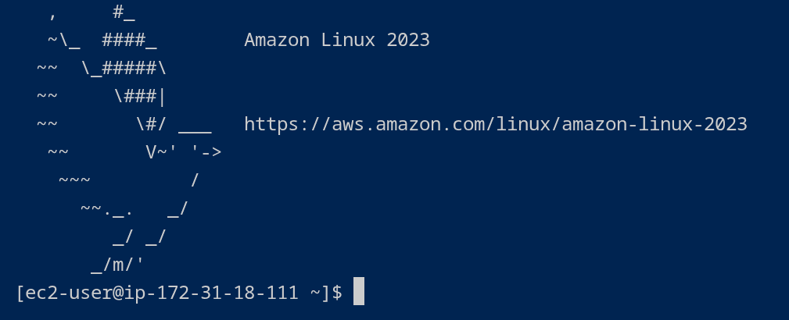
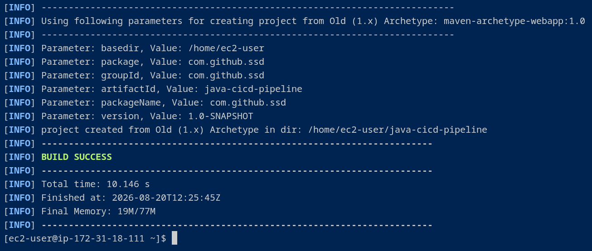
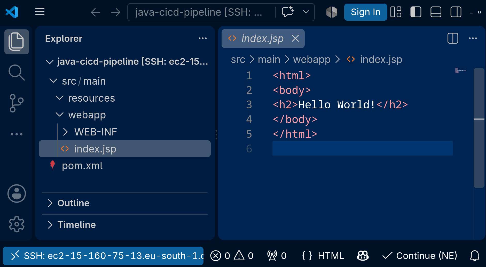
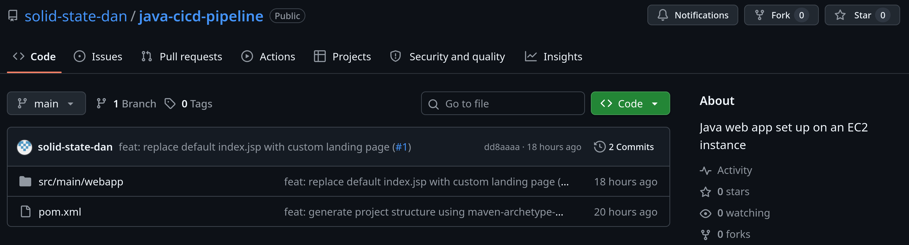

# Part 1: Cloud Web App Setup

## Project's Introduction

This project is part one of a series of projects where I'm building a CI/CD pipeline.

Here, I launched an EC2 instance, connected to it using VS Code, and built a CI/CD pipeline to automate the build and deployment of a basic Java web application.

### Key tools and concepts

Services I used were Amazon EC2 and VS Code. Key tools and concepts I learnt include Apache Maven and Amazon Corretto 8, SSH connections, public IPv4 address, launching an instance and connecting to it using key pairs, whether that's over the terminal or over the VS Code SSH connection.

### Project reflection

This project took me approximately 2 hours. I spent quite some time figuring out the configuration for the EC2 instance, since I wanted to better understand the costs associated with my choices. It was also rewarding to SSH into the newly created instance and start editing it with an IDE.

That being said, let's go back to the start and look at exactly what I did at each stage.



## Launch an EC2 instance

### What I did in this step

In this step, I launched an EC2 instance, configured its network settings to enable connectivity, and created a key pair for secure authentication and access to it.

I chose the **Arm** architecture (**which is more cost-effective** compared to x86) and a **t4g.micro** instance type, since this project didn't require much computational power nor a specific architecture.

<figure><figcaption></figcaption></figure>

This instance served as my cloud-based development and deployment environment, since I wanted the web application and its development workflow to run entirely in the cloud.

### I also enabled SSH

SSH is a network protocol used to securely access and manage remote servers. It ensures that only authorized users can connect, commonly using a public/private key pair for authentication.

After authentication, SSH creates an encrypted connection so that all communication between the user and the server remains secure.

### Key pairs

A key pair is used, in this case, to securely connect to an EC2 instance through SSH. It consists of a public key, which is stored on the instance by AWS, and a private key, which is downloaded and kept securely by the user when the key pair is created.

### Downloaded key pair file

When I connect using the private key, the EC2 instance checks whether it matches the stored public key. If the keys match, I am authenticated and granted access.

### Updating file permissions

I updated my private key's permissions by running this command:

```bash
chmod 400 /path/to/<my-key-name>.pem
```

This command restricts file access so only I can read the key, which is a security requirement for SSH connections.



## SSH connection to EC2 Instance

### What I did in this step

In this step I connected to the EC2 instance, via the terminal, so that I could start setting up the web app code inside.

### Connecting to EC2

To connect to the EC2 instance, I ran the command:

```bash
ssh -i </path/to/my-key.pem> ec2-user@<my-ec2-ipv4-address>
```

This command sets up an SSH connection directly between my local computer and the instance.

<figure><figcaption></figcaption></figure>

### This command required an IPv4 address

An EC2 instance’s public DNS name is a human-readable address that maps to the instance’s public IPv4 address. My local computer can use this DNS name to locate and connect to the EC2 instance over the internet.



## Maven & Java

### What I did in this step

To begin setting up the web application, I first installed Amazon Corretto 25 (Java) and Apache Maven (3.9.16) on the EC2 instance.

```bash
# Install the JDK for Amazon Corretto 25
sudo dnf install java-25-amazon-corretto-devel
```

```bash
# Install Maven
wget https://dlcdn.apache.org/maven/maven-3/3.9.16/binaries/apache-maven-3.9.16-bin.tar.gz
sudo tar -xvf apache-maven-3.9.16-bin.tar.gz -C /opt
echo "export PATH=/opt/apache-maven-3.9.16/bin:$PATH" >> ~/.bashrc
source ~/.bashrc
```

<figure><figcaption></figcaption></figure>

### Why I'm using Maven

Apache Maven is a build automation tool for Java projects. It helps build the project, manage dependencies, and provides archetypes (templates) to quickly generate standard project structures.

It is required in this project because I wanted to use its ability to spin up web apps using archetypes.

### Why I'm using Java

Java is a widely used programming language for web applications and enterprise systems, and Maven also needs Java in order to work.



## Create the Application

### What I did in this step

In this step, I set up the web application on the EC2 instance, using Maven and Java.

### Creating the Java web app

I generated a Java web app using the command:

```bash
mvn archetype:generate \
-DgroupId=com.github.ssd \
-DartifactId=java-cicd-pipeline \
-DarchetypeArtifactId=maven-archetype-webapp \
-DinteractiveMode=false
```

This command tells Maven to generate a web app using a existing template that it has and call the generated web app project "java-cicd-pipeline".

<figure><figcaption></figcaption></figure>



## Use Remote - SSH

### Installing Remote - SSH

In this step, I connected VS Code to the EC2 instance using the Remote- SSH extension, allowing me to manage the server through VS Code instead of a terminal session, as I have done until now.

### SSH configuration details

The remote connection configuration includes the host address of the EC2 instance, the identity file containing the private key, and the user account used for SSH authentication.

<figure><figcaption></figcaption></figure>



## Create the Application

### Exploring the project structure

Now that I could use VS Code's file explorer, I could see a bunch of folders and subfolders that define the web app.

These folders organize different parts of the web app. For example, the resources sub-folder stores connection details, while the webapp sub-folder stores web app files for the look and feel of the web app.

### Updating the web app

The index.jsp is a JavaServer Pages (JSP) file that combines static HTML with dynamically generated server-side content.

I edited index.jsp by updating the HTML code to also say "Hello {MY NAME}!". I also added a paragraph that says "This is my web app working".



## Source Control with GitHub

### What I did in this step

To preserve my progress and prepare for automation, I created a remote GitHub repository and pushed the application code from my EC2 instance to it.

<figure><figcaption></figcaption></figure>

### Setting up the CI/CD foundation

Creating this repository is a critical step for the next phases of this project series. This GitHub repository will act as the centralized source code repository, which will later serve as the webhook trigger to automate the build and deployment pipeline.


