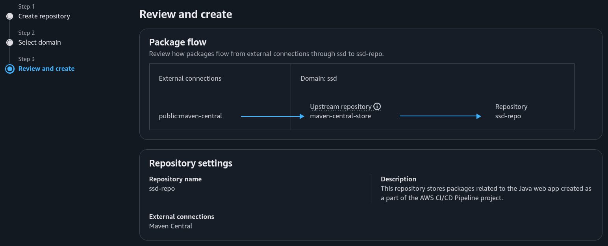
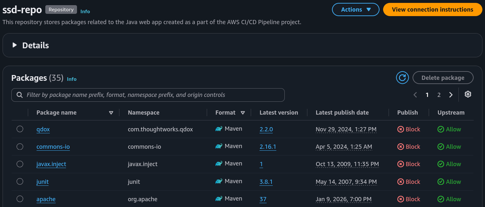
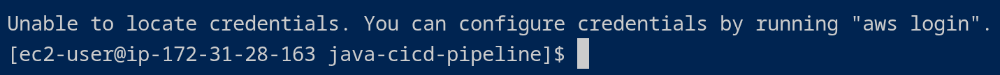
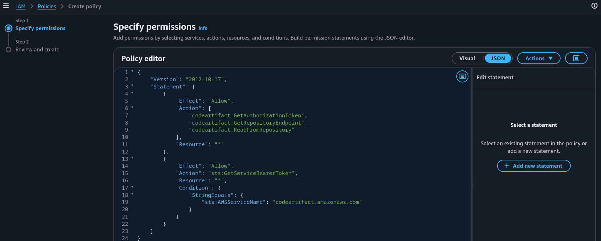
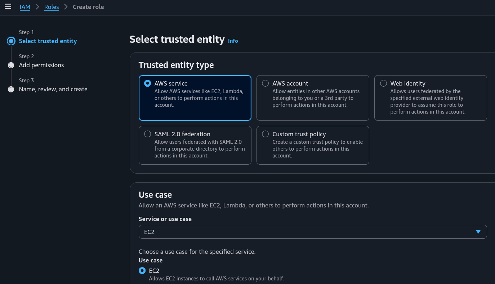
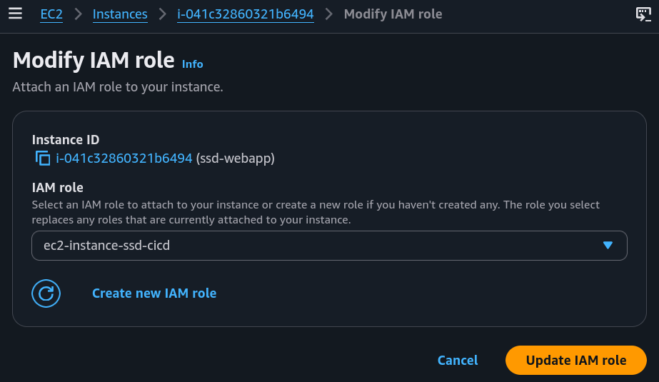
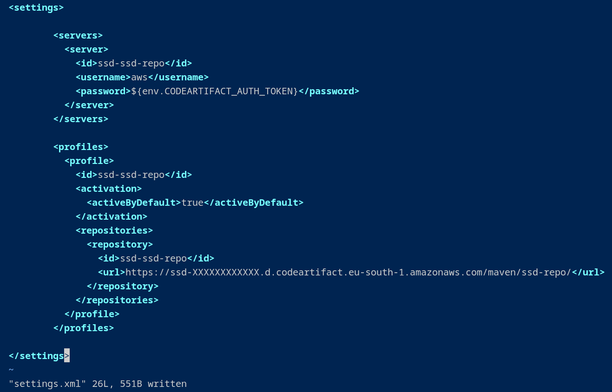
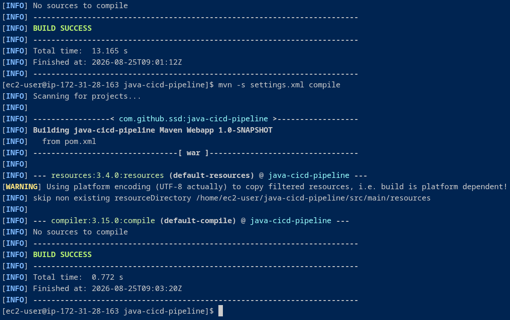

# Part 2: CodeArtifact Packages

## Project's Introduction

This project is part two of a series of projects where I'm building an AWS CI/CD pipeline. Here, I set up CodeArtifact as my CI/CD pipeline's artifact repository.

### Key tools and concepts

Services I used include CodeArtifact, IAM and EC2. Key concepts I learnt include using artifact repositories, connecting Maven to CodeArtifact and setting up IAM permissions to give the EC2 instance the permission to access CodeArtifact.

### Project reflection

This project took me approximately 2.5 hours. I did it to get hands-on experience with package management and to learn why and how artifact repositories are essential in modern DevOps, and I now understand that they are massive time-savers that bring a ton of security and reliability to your builds. The trickiest part was working through the AWS CLI commands, where I hit a few roadblocks with permission settings and file names. However, fixing those errors made the result even better. It was incredibly rewarding to finally see CodeArtifact fill up with packages once the connection went live.



## CodeArtifact Repository

### Why CodeArtifact?

AWS CodeArtifact is an artifact repository service. We use it to create repositories that store our web app's packages and dependencies. In modern engineering teams, these repositories are essential for maintaining security, control, and reliability across the development lifecycle.

<figure><figcaption></figcaption></figure>

### Understanding Domains

In AWS CodeArtifact, a domain is essentially a folder that groups multiple repositories together. It acts as a central hub for security, allowing to manage permissions for all internal repositories at once instead of setting them up individually.

### Upstream Repositories & Maven Central

A CodeArtifact repository can connect to an upstream repository, which acts as a backup public source. If Maven can’t find a package in my local repository, it automatically checks the upstream source instead. For this project, I set the upstream to Maven Central (the largest repository for Java packages) which is incredibly helpful when building a Java web app.



## CodeArtifact Security

### Issue

<figure><figcaption></figcaption></figure>

<figure><figcaption></figcaption></figure>

To connect to CodeArtifact, my EC2 instance needed a 12-hour authentication token. However, I initially ran into an error trying to fetch it. That was because, by default, EC2 instances don't have permission to access external AWS resources. This aligns with the security principle of least privilege, meaning I had to explicitly grant the necessary access.

### Resolution

To fix the error with my security token, I created an IAM policy that grants the required CodeArtifact permissions and attached it to a new IAM role. I then assigned this role to the EC2 instance, allowing it to successfully request the authorization token and connect to the repository.

<figure><figcaption></figcaption></figure>

<figure><figcaption></figcaption></figure>

<figure><figcaption></figcaption></figure>

Using IAM roles is an industry best practice because they are far more secure and scalable than hardcoding credentials. Hardcoding access keys leaves you vulnerable to security leaks, misuse, and unexpected downtime. In contrast, IAM roles are managed entirely through AWS without exposing real credentials. Plus, they are also much easier to scale if multiple EC2 instances need the exact same set of permissions later on.

### The JSON policy attached to my role

The IAM policy explicitly grants access to CodeArtifact by authorizing three key actions:

* Retrieving an authorization token (GetAuthorizationToken)
* Locating the repository endpoint (GetRepositoryEndpoint)
* Viewing the packages inside the repository (ListPackages / ReadFromRepository)



## Maven and CodeArtifact

### Testing the Connection

To make sure Maven and CodeArtifact were talking to each other, I ran a test compilation of my web app using settings.xml. This configuration file gives Maven the exact name and authorization token it needs to gain entry to the repository. I also set up a profile section inside it, which acts as a guide to tell Maven exactly which repository to target if I'm working with multiple environments.

<figure><figcaption></figcaption></figure>

### The Compilation and Retrieval Process

Maven is not only a package manager, but also a compiler. So, I asked Maven to compile the web app code, which triggered a specific dependency search:

1. **Local Check:** Maven first checked my local CodeArtifact repository for the required packages.
2. **Upstream Fallback:** Since my repository was brand new and empty, CodeArtifact seamlessly redirected Maven to its upstream source, Maven Central.
3. **Caching:** Maven downloaded the packages from Maven Central and securely cached local copies right back into CodeArtifact for future builds.

<figure><figcaption></figcaption></figure>

### Verify Connection

To make sure everything worked, I checked CodeArtifact after the build completed. Seeing four pages of packages inside was the ultimate proof that the pipeline connection was successful and that all of my web app's dependencies were now safely stored in the repository.



## Project Extension: Uploading My Own Packages

As an extension to this project, I also set up CodeArtifact to let me publish my own custom packages. This approach mimics a common real world scenario where engineering teams build internal packages and want to share them securely with teammates, without exposing proprietary code to the public internet.

### Creating and Securing the Package

To simulate creating my own package, I bundled a placeholder text file using tar. I also generated a security hash for the archive. This provides CodeArtifact with a way to verify file integrity; if the package is tampered with or corrupted during transit, CodeArtifact’s calculated hash won't match mine, and the upload will fail.

### Publishing via AWS CloudShell

To publish the package, I ran an AWS CLI command directly within CloudShell to upload my archive to the repository. Then, when I viewed the package details in the CodeArtifact console, I could see all the metadata, including the version number, publish date, and the origin (which explicitly shows this CodeArtifact repository as the source).

### Package Validation

To validate the setup, I tried downloading the package back into my CloudShell terminal. The download and installation from CodeArtifact went through successfully. I then extracted the archive and read the contents of the text file. Seeing the exact message I originally wrote proved that my private package repository was fully functional for both storing and retrieving artifacts.


