# Part 4: Deployment (CodeDeploy)

## Project Overview

This project is part three of a series of projects where I'm building an AWS CI/CD pipeline. I did this project to learn how deployment works, and how it can be automated using a combination of CodeDeploy and deployment scripts. By the end of it, I was able to finally see a live website.

### Key tools and concepts

* Services used: CodeDeploy, CodeBuild, CodeArtifact, IAM, CloudFormation, EC2, S3, CodeConnection, and GitHub.
* What I learned: The ins and outs of deployment, including deployment groups, deployment scripts, and working with appspec.yml.
* Biggest takeaway: The critical importance of rebuilding the project before deploying.

### Project reflection

This project took me around 3.5 hours to complete. Connecting all the new concepts was definitely the biggest challenge, but seeing the deployed web app at the end was incredibly rewarding.

## Project Walkthrough



## Deployment Environment

### Environment Isolation

To set up CodeDeploy, I launched an EC2 instance and a VPC to serve as my production environment. Keeping development and production environments separate is essential. It ensures that code currently being written doesn't affect actual users until it is fully ready to go live.

### Infrastructure as Code (IaC)

Rather than launching these resources manually, I used CloudFormation. The great thing about this approach is that when I need to tear down the environment, I can just delete the CloudFormation stack. This automatically cleans up all the resources inside it at once.

<figure>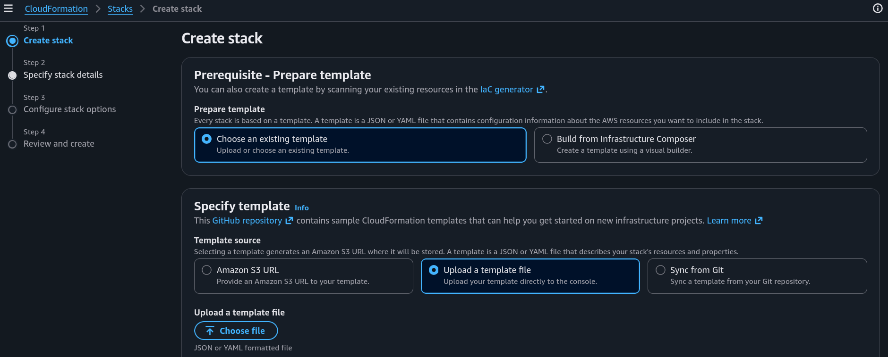<figcaption></figcaption></figure>

<figure>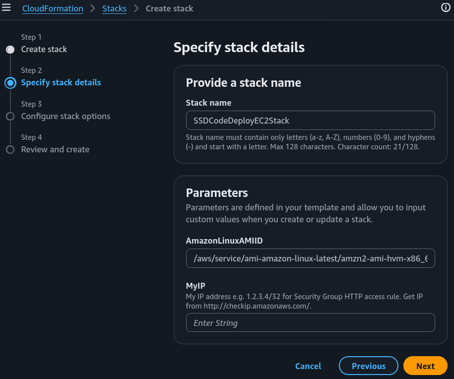<figcaption></figcaption></figure>

<figure>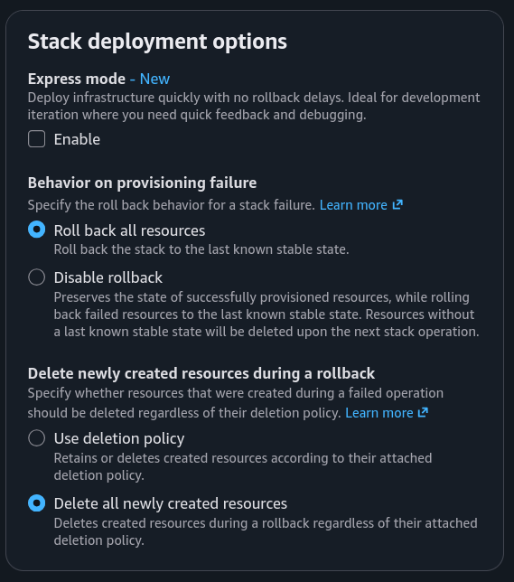<figcaption></figcaption></figure>

<figure>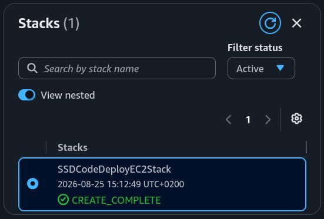<figcaption></figcaption></figure>

### Configuring the Network Architecture

The template also includes networking resources like a VPC, internet gateway, route tables, and subnets. These are essential because a production environment has specific rules for allowing and blocking traffic. Setting up a dedicated network like this is standard practice to ensure a reliable deployment.



## Deployment Scripts

* `install_dependencies.sh`: Installs everything the EC2 instance needs to host the app, such as the Tomcat application server.

<figure>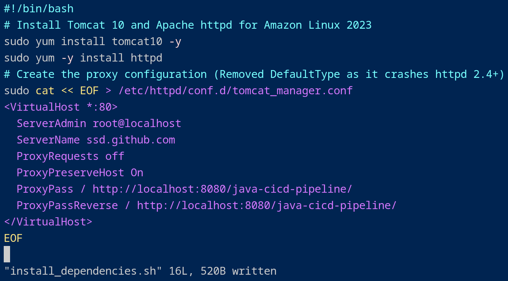<figcaption></figcaption></figure>

* `start_server.sh`: Launches the two servers running on the instance. It starts Tomcat to run the Java application and Apache to handle incoming web traffic and forward requests to Tomcat.

<figure>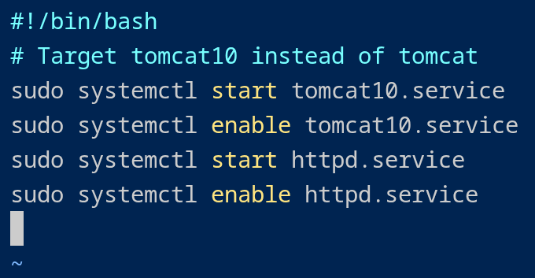<figcaption></figcaption></figure>

* `stop_server.sh`: Safely shuts down both Apache and Tomcat when they are no longer needed.

<figure>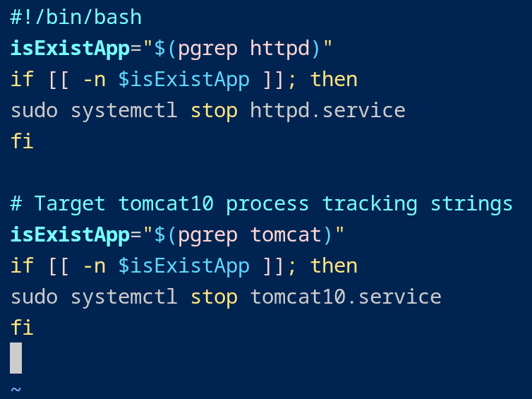<figcaption></figcaption></figure>



## Lifecycle Hooks (`appspec.yml`)

Next, I wrote an `appspec.yml` file to give CodeDeploy specific instructions for the deployment. It hooks into different lifecycle stages using the scripts I wrote:

<figure>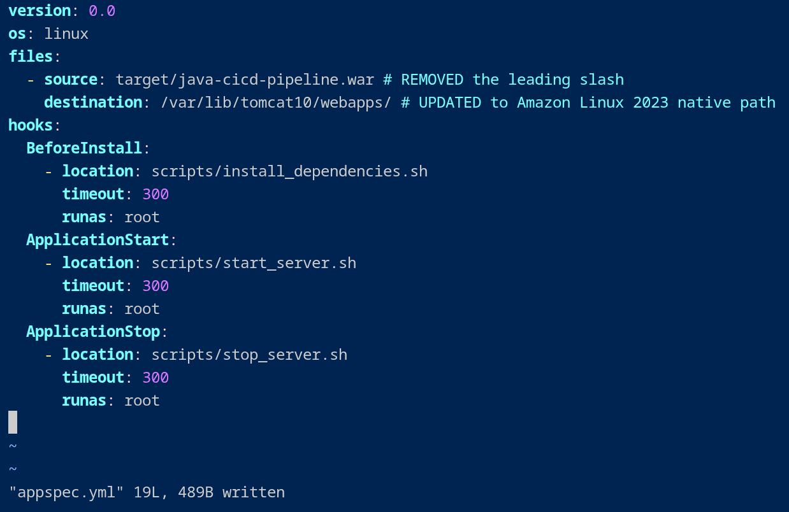<figcaption></figcaption></figure>

* **BeforeInstall:** Runs `install_dependencies.sh` to get Tomcat and other dependencies ready.
* **ApplicationStart:** Runs `start_servers.sh` to spin up Apache and Tomcat.
* **ApplicationStop:** Runs `stop_servers.sh` to safely shut down the existing servers before a new deployment.

I also updated the `buildspec.yml` file to tell CodeBuild to include the new `appspec.yml` and deployment scripts inside the build artifact (the compressed `.war` file).

<figure>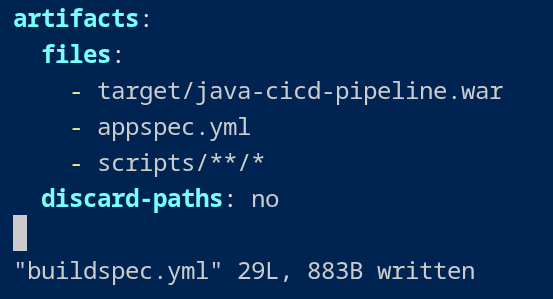<figcaption></figcaption></figure>



## Setting Up CodeDeploy

### Applications vs. Groups

To configure CodeDeploy, I set up an application and a deployment group.

* **CodeDeploy Application:** Acts as a logical container that groups together all the deployment configurations and deployment groups for a single application.

<figure>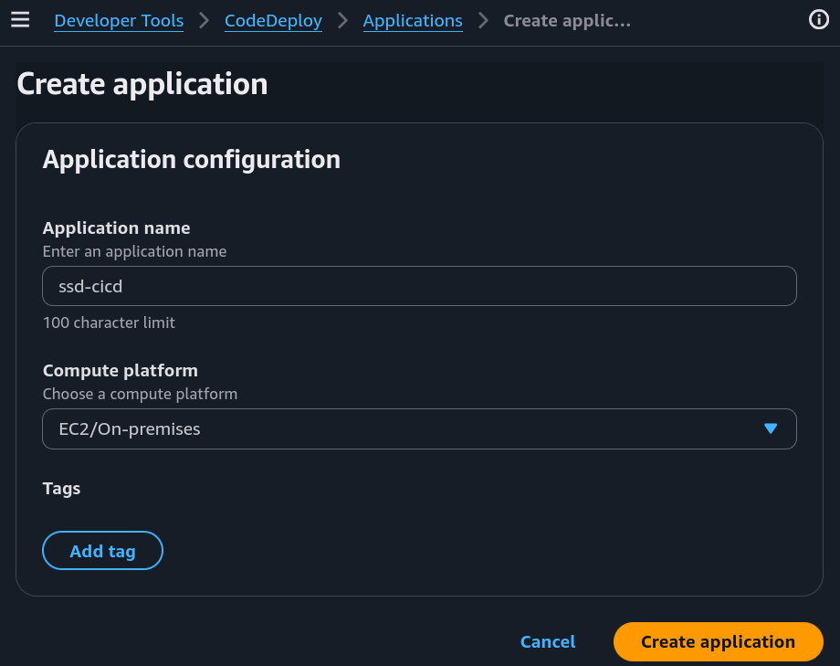<figcaption></figcaption></figure>

* **Deployment Group:** A set of target EC2 instances along with the specific settings that dictate exactly how the web app should be deployed to them.

<figure>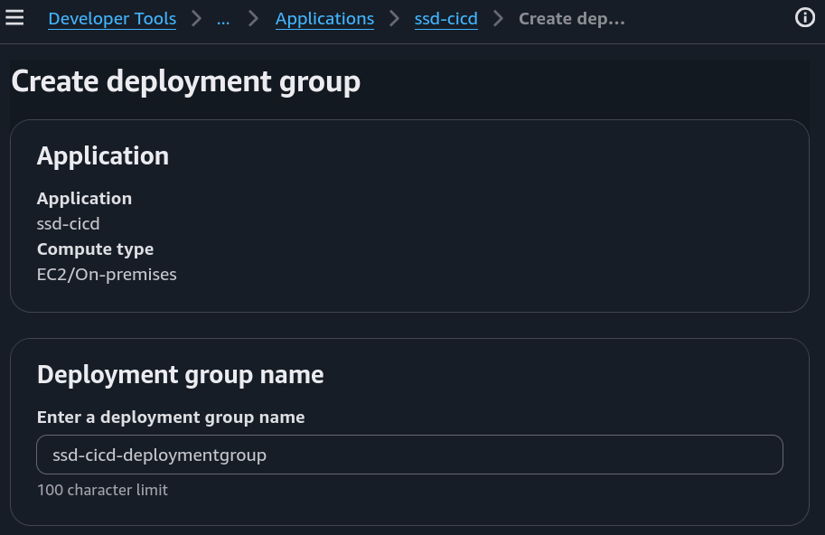<figcaption></figcaption></figure>

### Granting Necessary Permissions

To set up the deployment group, I also created an IAM role to grant CodeDeploy permission to access and manage the EC2 instances. Without this role, CodeDeploy wouldn't have the access required to send deployment instructions to the instances.

<figure>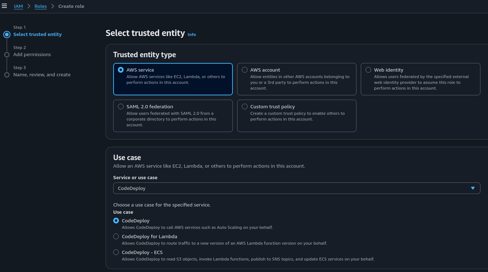<figcaption></figcaption></figure>

### Automated Tagging and Scaling

Tags are incredibly helpful for identifying which instances should receive the web app. I used the tag `role: webserver` to match the EC2 instance created by my CloudFormation template. In the future, if I want to add more instances to this deployment group, I just need to give them the same tag, and they will be included automatically, which will be a huge time saver.

<figure>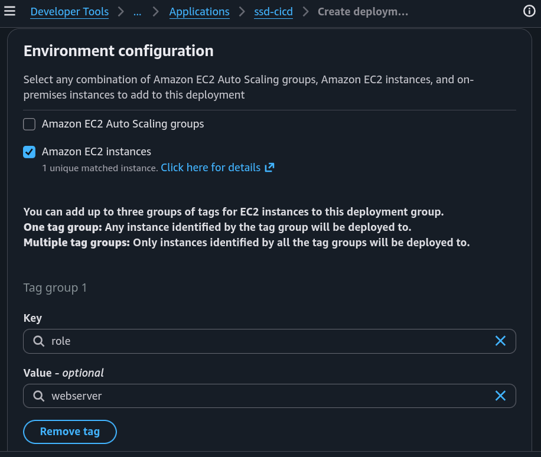<figcaption></figcaption></figure>



## Deployment Configurations

### Choosing a Rollout Strategy

The deployment configuration controls how quickly and safely an application rolls out. I chose `CodeDeployDefault.AllAtOnce`, which updates every EC2 instance in the deployment group simultaneously. While this carries more risks, it is the fastest deployment method, making it ideal for quick updates during development.

<figure>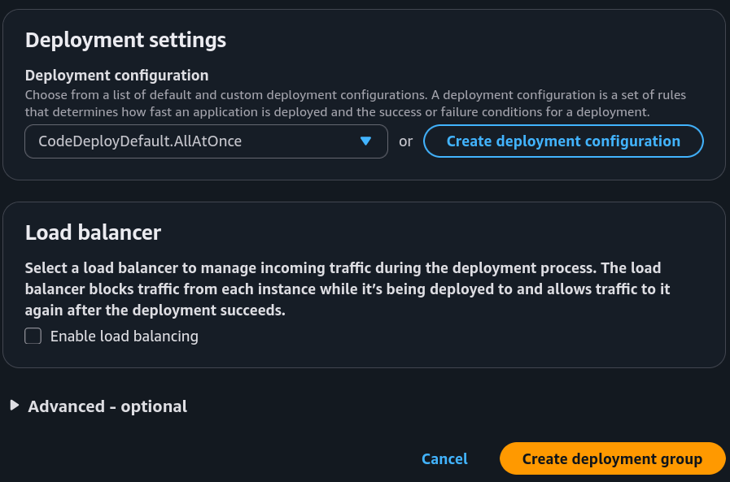<figcaption></figcaption></figure>

### Instance Coordination via Agent

I also installed the CodeDeploy Agent on the EC2 instance, which acts as the bridge. It receives instructions directly from CodeDeploy and handles running the specific scripts defined in the `appspec.yml` file.

<figure>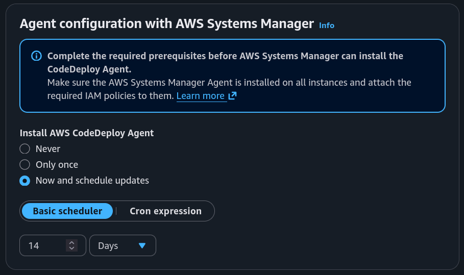<figcaption></figcaption></figure>



## Deployment Execution & Verification

### Deployments vs. Deployment Groups

A CodeDeploy deployment is the actual rollout of a specific application update to my users. To look at the difference: the deployment group acts like a blueprint/settings file, while the deployment itself is the live update being executed using those settings (like the actual construction work using that blueprint).

### Managing Build Artifact Locations

I configured the revision location so CodeDeploy knows where the compressed `.war` file is stored. Since I linked CodeBuild to an S3 bucket, my build artifacts automatically drop right into that bucket, making it the perfect deployment source.

<figure>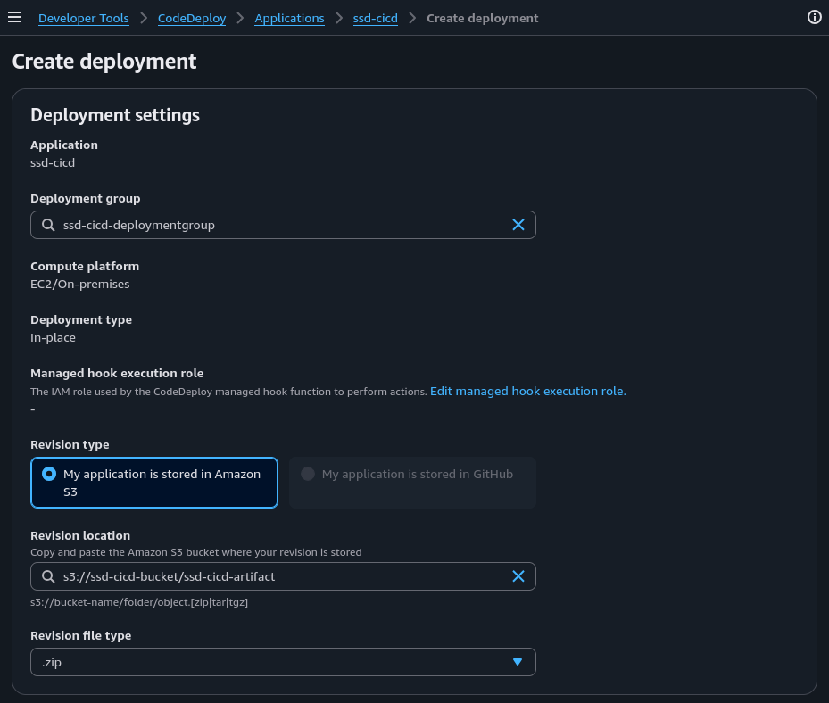<figcaption></figcaption></figure>

### Verifying the Live Application

<figure>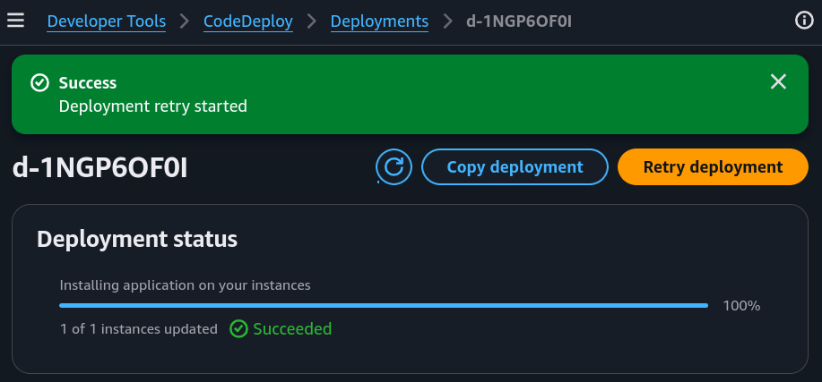<figcaption></figcaption></figure>

To verify that the deployment was successful, I visited the IPv4 DNS address of the EC2 instance. And yes, the web app was live, running smoothly, and successfully serving traffic.

<figure>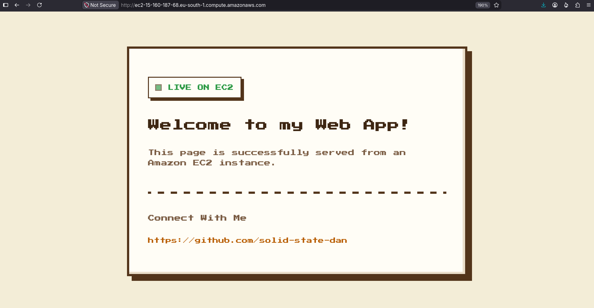<figcaption></figcaption></figure>


