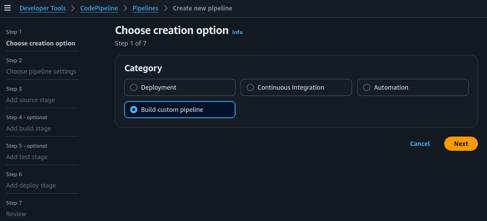
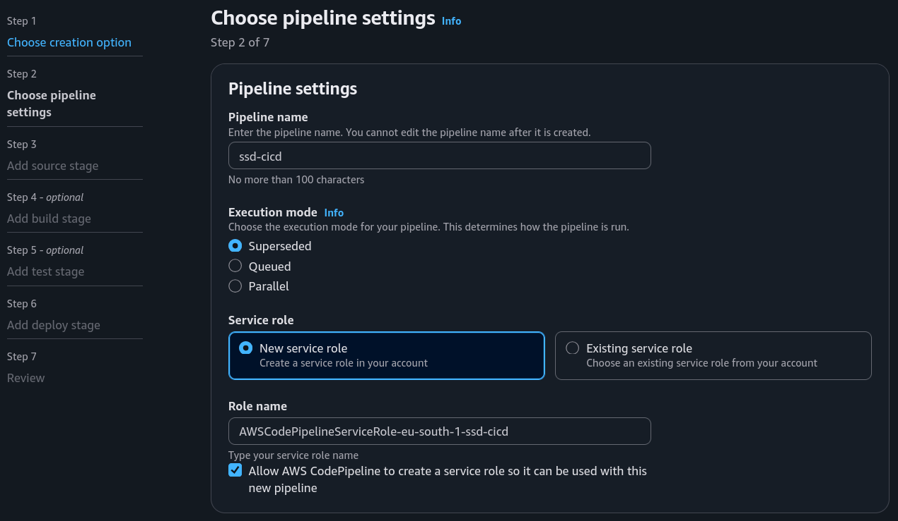
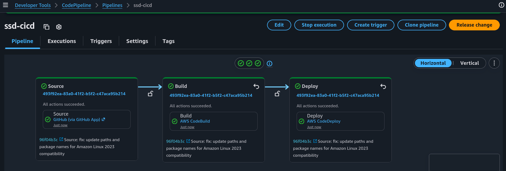
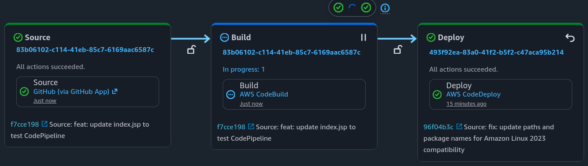
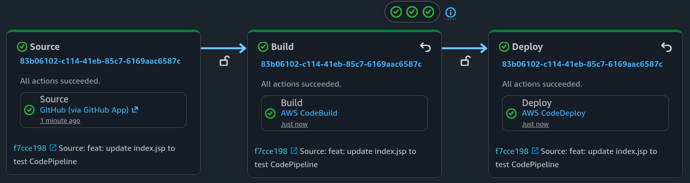
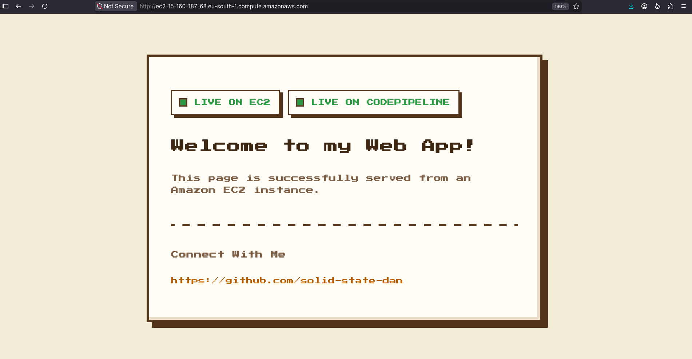

# Part 5: Pipeline Automation (CodePipeline)

## Project Overview

This project completes my AWS CI/CD pipeline series. It shows how to use CodePipeline to connect GitHub directly to CodeDeploy. Now, the entire process is automated. Whenever I push a code change to GitHub, the updated web app goes live in production automatically, skipping any manual steps in CodeBuild or CodeDeploy.

### Key tools and concepts

* **Tools:** AWS (CodePipeline, CodeDeploy, CodeBuild, CodeArtifact, EC2, S3, IAM, CloudFormation), GitHub, and VS Code.
* **Concepts Learnt:** CI/CD pipeline stages and webhook integration.

### Project reflection

This project took about 2 hours to complete. The most rewarding part was seeing the web app update live in production automatically, without me having to trigger the build or deployment manually.

## Project Walkthrough



## Starting a CI/CD Pipeline

### Connecting GitHub to CodeDeploy

I used AWS CodePipeline to build a bridge between GitHub and CodeDeploy. The goal here is to automate the whole lifecycle, making deployments repeatable and eliminating the risk of human error that comes with manual steps.

### Selecting the Pipeline Execution Mode

CodePipeline handles multiple concurrent runs using different execution modes. I chose **Superseded**, which prioritizes the latest code push and cancels older, ongoing runs. The other available options are **Queued** (runs execute sequentially in the order received) and **Parallel** (multiple runs execute at the same time).

<figure><figcaption></figcaption></figure>

<figure><figcaption></figcaption></figure>

### Automatically Granted Permissions

The setup automatically provisions an IAM service role. This securely grants CodePipeline the access required to manage the workflow stages, such as linking to GitHub via CodeConnections and storing artifacts in S3.



## CI/CD Stages

### Defining the Three Pipeline Stages

The automation relies on three key phases:

1. **Source:** fetching the web project repository from GitHub
2. **Build:** compiling the app with CodeBuild
3. **Deploy:** distributing live updates through CodeDeploy

### 1. Source Stage

The Source stage is all about pointing the pipeline to the GitHub repository. Setting a default branch tells CodePipeline exactly which version of the code to use. Real-world projects usually have lots of different branches, so specifying the main branch ensures we only deploy the code that is actually ready for production.

This stage is also where I enabled webhook notifications. The moment a code commit hits GitHub, the webhook detects the change and signals CodePipeline to start a new execution right away.

### 2. Build Stage

The Build stage manages application compilation. I designated AWS CodeBuild as the provider to automate the packaging and preparation of the web application for production.

### 3. Deploy Stage

The Deploy stage handles the actual rollout of the application. I designated AWS CodeDeploy as the deployment provider to automate the final release phase. CodeDeploy ingests the BuildArtifact outputted by the Build stage. It then uses the environment and deployment strategies defined within the deployment group to push the updates live.

### Visualizing the Deployment Flow

CodePipeline automatically maps these stages into a unified visual diagram that tracks code changes from start to finish. From this dashboard, I can monitor execution details for each step and use handy shortcuts to jump directly to the underlying AWS services.

<figure><figcaption></figcaption></figure>



## Live Test and Results

### Testing the Pipeline Triggers

Because the whole point of this setup is to let code changes trigger the workflow, I needed to test it out. I opened up the `index.jsp` file, added a quick new line of code, and pushed the update to GitHub.

### Monitoring Real-Time Stage Updates

CodePipeline detected the push immediately and kicked off a new execution. As the code moved through the workflow, the active commit message appeared under each stage to show exactly which version was processing, starting at the Source stage and cleanly progressing through Build and Deploy.

<figure><figcaption></figcaption></figure>

### Verifying the Live Production Release

After the pipeline completed its run, I refreshed the live web app in my browser and... yes, the changes were already live, proving the pipeline completely eliminates manual build and deployment steps.

<figure><figcaption></figcaption></figure>

<figure><figcaption></figcaption></figure>


