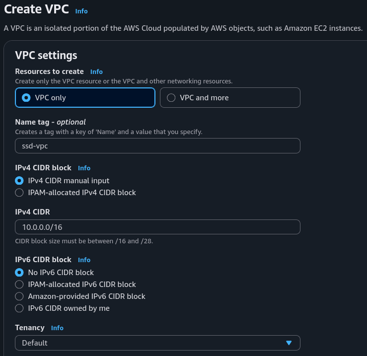
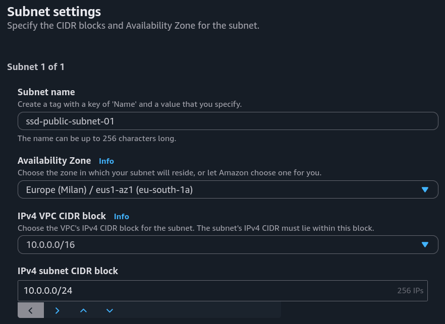
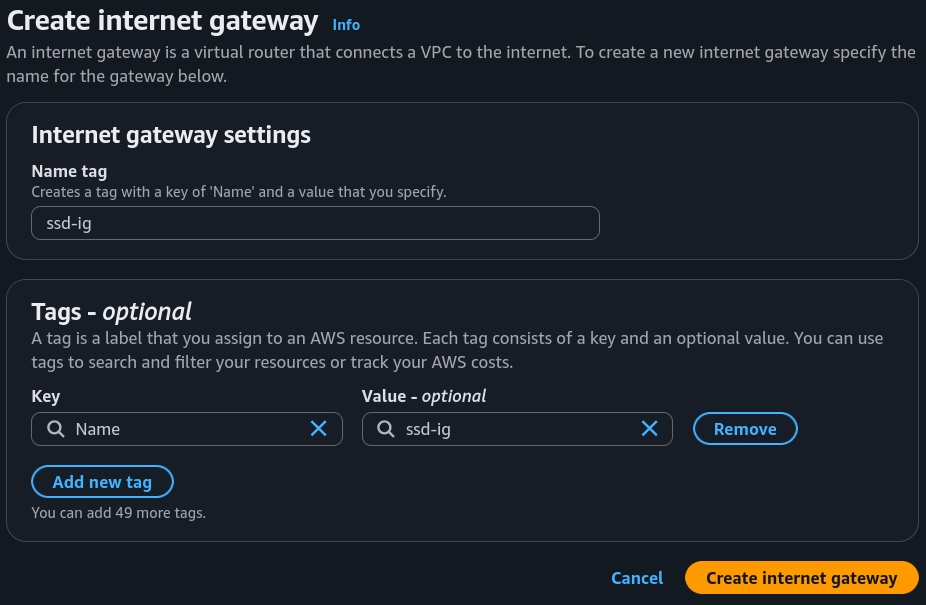
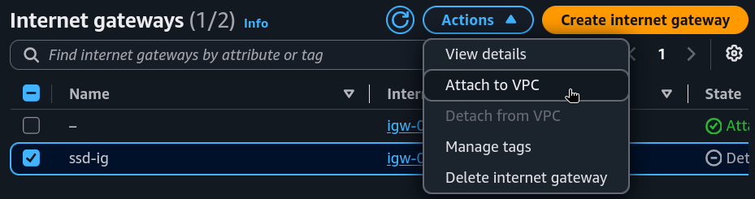

# Part 1: Build a Virtual Private Cloud (VPC)

## Project Overview

In this first part of the project, I set up and configure a VPC from scratch.

### Key tools and concepts

* **Tools:** AWS VPC.
* **Concepts Learnt:** VPC, Subnets, Internet Gateway.

## Project Walkthrough



## Virtual Private Clouds (VPCs)

### What I did in this step

In this step, I configured the settings of the VPC I want to create.

<figure><figcaption></figcaption></figure>

### How VPCs work

VPCs (Virtual Private Cloud) are the reason why resources can be made private to me, and made public if I want to. Without it, all resources would always just be public, scattered around one giant place, with no privacy, so for everyone to access and see (which is definitely not ideal...).

### Why there is a default VPC in AWS accounts

There was already a default VPC in my account ever since my AWS account was created. AWS does so that everyone could deploy resources and connect services right away (because without a VPC set up first, we wouldn't be able to launch some common resources, e.g. EC2 instances).

### Defining IPv4 CIDR blocks

To set up my VPC, I had to define an IPv4 CIDR (Classless Inter-Domain Routing) block, which is written as an IP address + /number. It is a way to assign a whole block of IP addresses.

We can tell the size of this block, by looking at the number after the slash. The smaller the number, the larger the CIDR block, since that number tells us how many first bits of the IP address are fixed, while the rest can be freely allocated.

### Overlapping CIDR blocks
Also, I realized that different VPCs can have the same CIDR block, since AWS treats every VPC as an isolated, distinct virtual network. This can come in handy for different cases (I don't have to worry about using up all the addresses; if I want Development and Production environments to have identical network layouts for consistency...). But, if I know that I will need to connect these networks together in the future, then I should use a unique, non-overlapping CIDR block for it, otherwise it would cause connectivity issues.



## Subnets

### What I did in this step

In this step, I created subdivisions within the VPC, called subnets, so I can start planning where different resources will live and operate.

<figure><figcaption></figcaption></figure>

### Creating and configuring subnets

Subnets are subdivisions within a VPC, and each of them group resources with similar access rules and restrictions. There are already subnets existing in my account, one for every Availabilty Zones (AZs) in the AWS Region I've set up the VPC in. 

### Public vs private subnets

The difference between public and private subnets are whether the resources inside can can access and be accessed from the the internet. For a subnet to be considered public, it has to be connected to an internet gateway first.

### Auto-assigning public IPv4 addresses

By default, resources already have a private IP address. By auto-assigning a public IPv4 address, when an EC2 instance is created, a public IP address will automatically be assigned to it, so that it will be accessible from the internet, without having to create one manually.



## Internet gateways

### What I did in this step

In this step, I connected my VPC to the internet, using an internet gateway.

<figure><figcaption></figcaption></figure>

<figure><figcaption></figcaption></figure>

### Setting up internet gateways

An internet gateway connects a city (VPC) and the outside world (internet).
Once connected, resources in the VPC can access the internet and be accessible to external users.

Attaching an internet gateway means resources in the VPC can now access the internet. The EC2 instances with public IP addresses also become accessible to users, so the applications hosted on those servers become public too.


