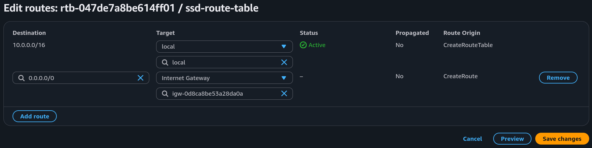
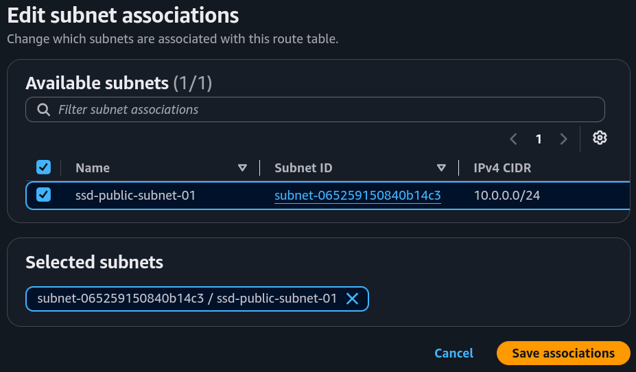
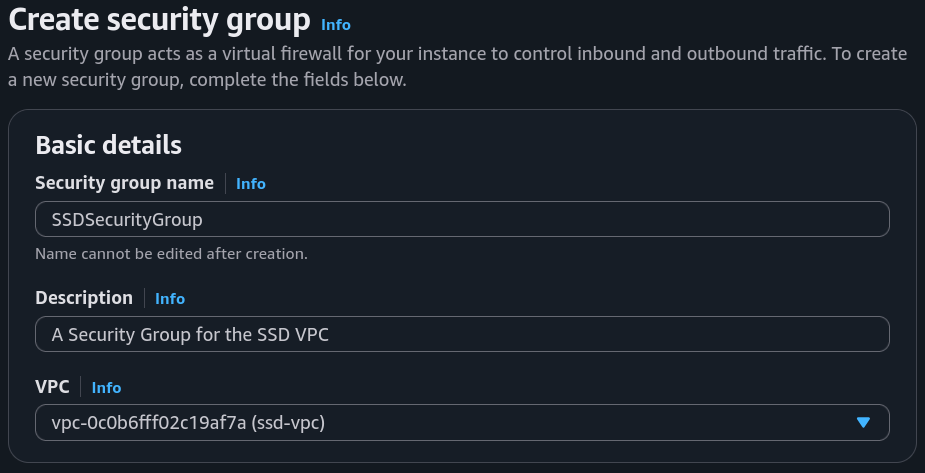
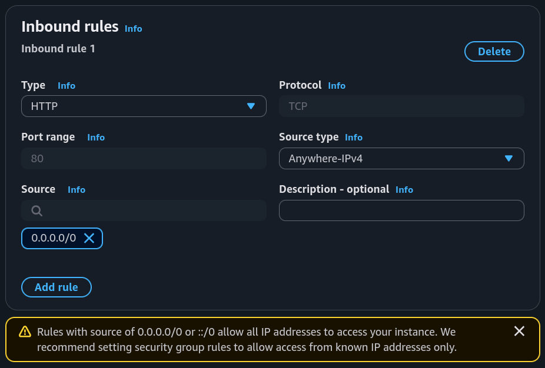
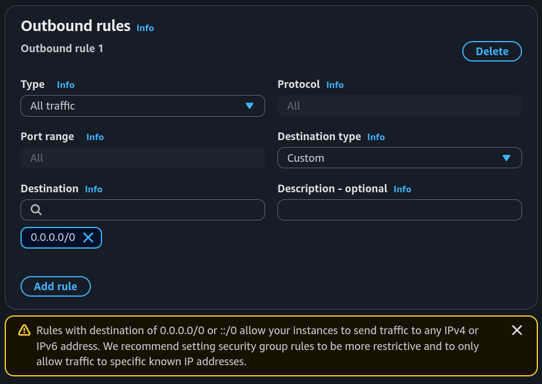
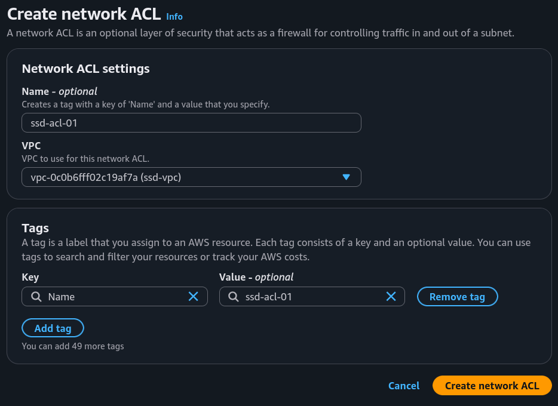
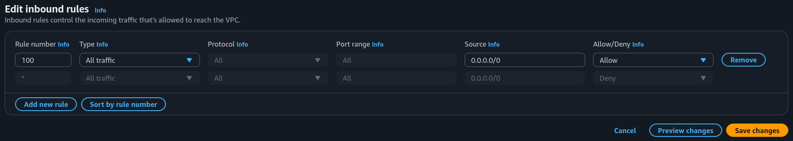
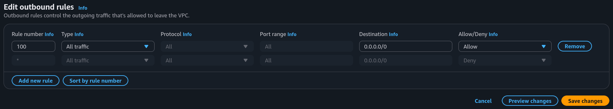
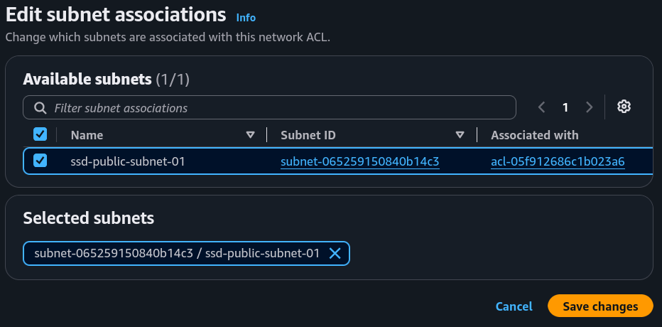
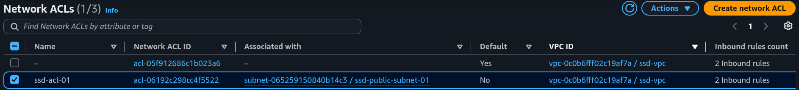

# Part 2: VPC Traffic Flow and Security

## Project Overview

### Key tools and concepts

* **Tools:** AWS VPC.
* **Concepts Learnt:** Route Tables, Security Groups, Network ACL.

## Project Walkthrough



## Route tables

**Route tables act like my VPC's GPS.** Without them, my network traffic simply won't know where to go. 

If I want to make a subnet public, I have to link it to an internet gateway. The only way I can build that connection is by writing a specific rule right into my route table.

### Route destination and target

**Inside my route table, every route needs a destination and a target:**
* **Destination:** The IP address range my traffic is trying to reach.
* **Target:** The actual path or gateway used to get there.

<figure><figcaption>To send traffic out to the internet, I set my destination to `0.0.0.0/0` (which means everywhere) and pointed the target directly to my internet gateway (`SSD IG`).</figcaption></figure>

<figure><figcaption>Explicit subnet associations tab.</figcaption></figure>



## Security groups

**Security groups act like my personal security guards**, monitoring all inbound and outbound traffic at the resource level. Instead of protecting the whole subnet at once, they stand guard over every single individual resource I deploy.

<figure><figcaption></figcaption></figure>

<figure><figcaption></figcaption></figure>

<figure><figcaption></figcaption></figure>

### Inbound vs Outbound rules

**There are two types of rules to control traffic flow through security groups:**
* **Inbound rules:** These restrict traffic coming *into* my resources. For example, I set up an inbound rule to allow all public HTTP traffic so users can visit my hosted web app.
* **Outbound rules:** These control traffic going *out* of my resources, like my app requesting data from an external source. By default, my security group automatically allows all outbound traffic.



## Network ACLs (Access Control List)

**Network ACLs act like my community watchmen**, securing my network at the subnet level rather than the individual resource level.

<figure><figcaption></figcaption></figure>

### Security Groups vs. Network ACLs

The main difference between the two is their scope. **Security groups protect my network at the resource level**, meaning they guard each individual resource. In contrast, **Network ACLs secure my network at the subnet level**, applying rules to an entire subnet at once.

Using both is a security best practice. It creates a dual layer of defense, ensuring all inbound and outbound traffic must pass at least two separate checkpoints.

### Rule Behavior: Default vs. Custom

**Just like security groups, Network ACLs rely on inbound and outbound rules, but their starting setups are completely opposite:**

* **Default Network ACLs:** These automatically allow all traffic. Both my inbound and outbound rules are set to wide open by default.
* **Custom Network ACLs:** These take a zero-trust approach. When I create a custom ACL, both inbound and outbound rules are automatically set to deny all traffic until I manually add exceptions.

<figure><figcaption></figcaption></figure>

<figure><figcaption></figcaption></figure>

<figure><figcaption></figcaption></figure>

<figure><figcaption>One Subnet -> Only One Network ACL: A subnet cannot have multiple competing ACLs. If I associate a new ACL with a subnet, it automatically replaces and removes the previous one.</figcaption></figure>


