# Create a Private Subnet

## Project Overview

In this project, I built a basic network layout in AWS to practice separating public and private zones. **The goal** was to learn how to **keep parts of a network safe by cutting them off from the internet.** To do this, I gave each zone its own unique IP range, blocked internet access using custom route tables, and set up strict rules to stop all unwanted traffic.

### Key tools and concepts

* **Tools:** AWS VPC.
* **Concepts Learnt:** VPC, Subnets, Internet Gateway, Route Table, Network ACL.

## Project Walkthrough

## 1. Private vs Public Subnets

### The Main Difference
- A **public** subnet is connected to the internet, so anyone can reach it. 
- A **private** subnet is cut off from the internet by default to keep the information safe.

Using private subnets is important because keeping resources away from the internet is critical for the security of confidential data and resources.

<figure>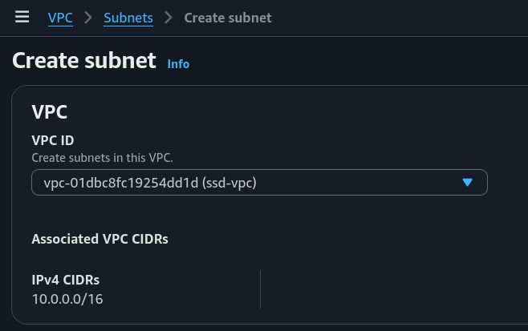<figcaption></figcaption></figure>

<figure>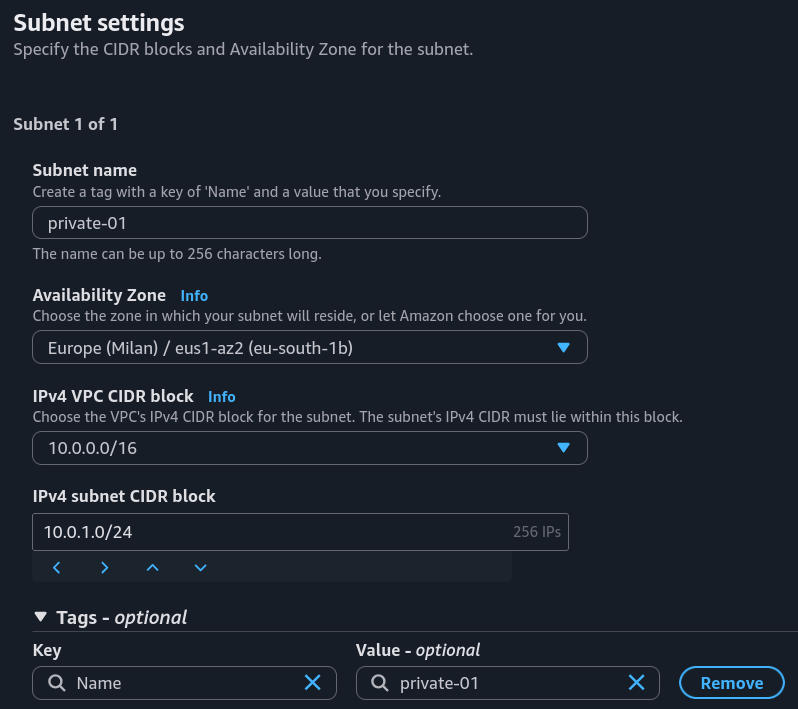<figcaption></figcaption></figure>

### The Rule for Subnet IP Addresses
Public and private subnets cannot use the same IPv4 CIDR block i.e. the same range of IP addresses. **Each subnet must have its own unique, non-overlapping CIDR block**.

<figure>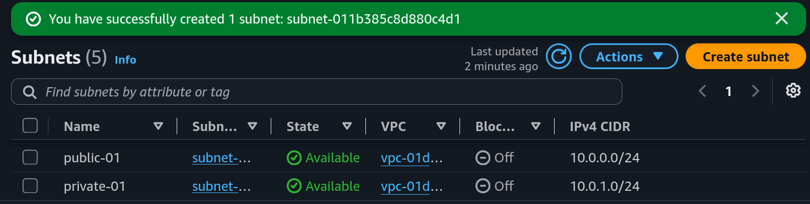<figcaption></figcaption></figure>

## 2. A Dedicated Route Table

### How Route Tables Work
**Route tables** are like GPS devices that help the resources in a subnet navigate the network. They **guide data to its proper destination, whether it is inside the VPC or out on the internet.**

### The Default Route Table Issue
By default, a private subnet is automatically linked to the main route table, which unfortunately includes a direct route to an internet gateway.

<figure>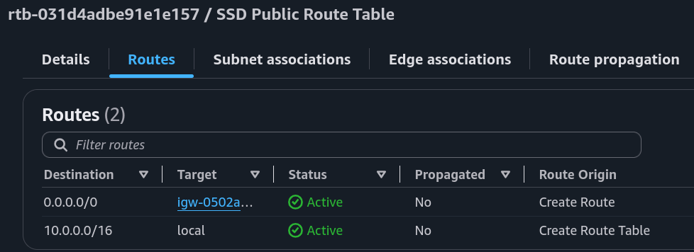<figcaption></figcaption></figure>

### Configuring the New Route Table
So, to make the subnet truly private, a new route table had to be set up because **a private subnet cannot have a route to an internet gateway.**

This **new route table only allows internal communication**, with rules that restrict all inbound and outbound traffic strictly to other resources within the VPC.

<figure>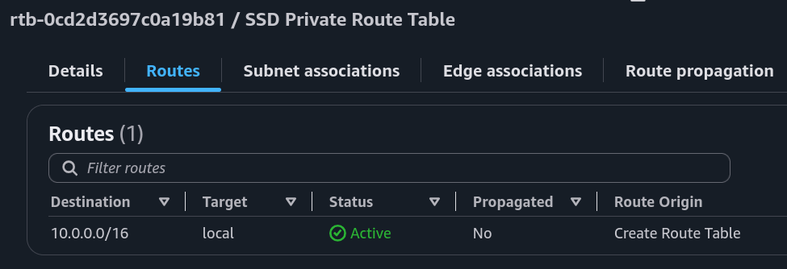<figcaption></figcaption></figure>

<figure>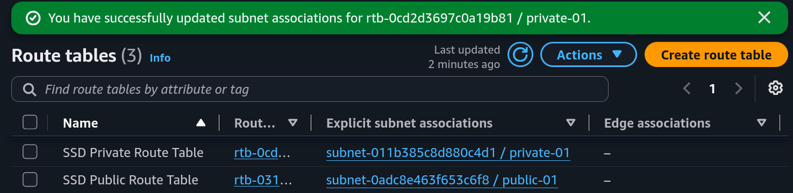<figcaption></figcaption></figure>

## 3. A Dedicated Network ACL

### What Are Network ACLs?
**Network ACLs** are a security feature that **controls inbound and outbound traffic at the subnet level**.

### The Default Network ACL Link
By default, a private subnet is automatically linked to the default network ACL that AWS creates for every VPC in an account.

<figure>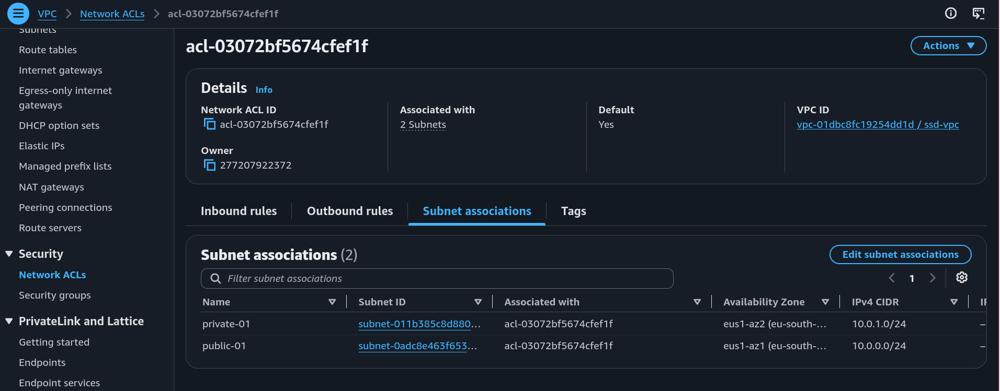<figcaption></figcaption></figure>

<figure>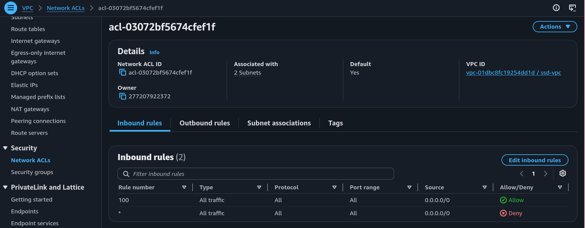<figcaption></figcaption></figure>

<figure>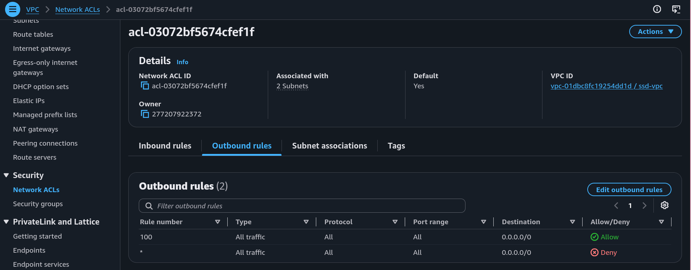<figcaption></figcaption></figure>

### Why a Dedicated Network ACL is Necessary
While removing the internet gateway blocks direct internet access, setting up a dedicated network ACL for the private subnet is still essential. **If a security breach happens and the public subnet is compromised, attackers can easily reach the private subnet if the network ACL rules are left open to all traffic.**

<figure>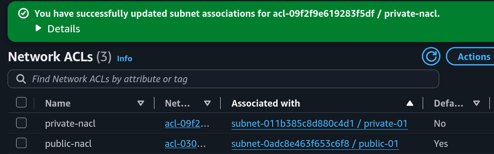<figcaption></figcaption></figure>

### The New Network ACL Rules
The **new network ACL** uses two simple rules: **it denies all inbound traffic and denies all outbound traffic.**

<figure>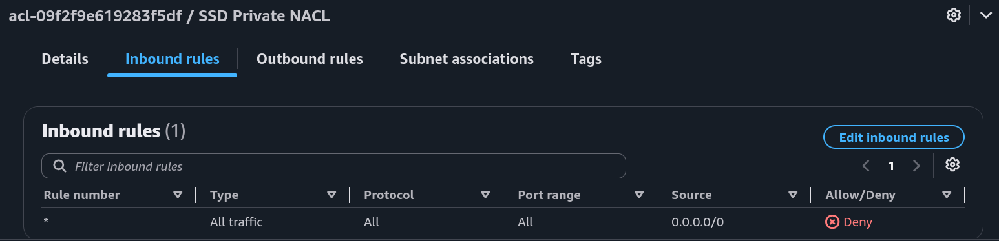<figcaption></figcaption></figure>

<figure>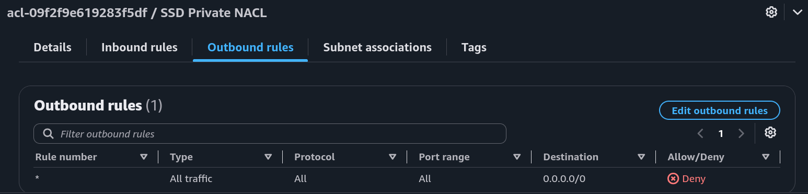<figcaption></figcaption></figure>

<figure>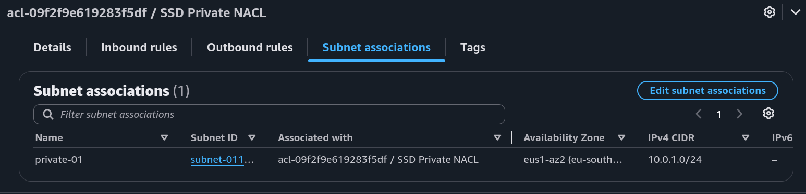<figcaption></figcaption></figure>