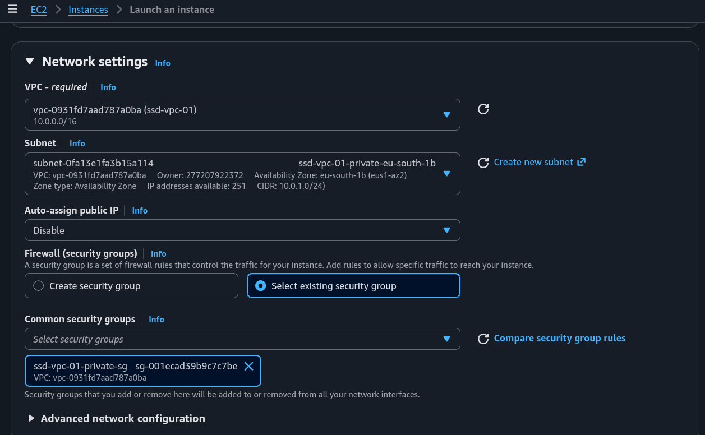
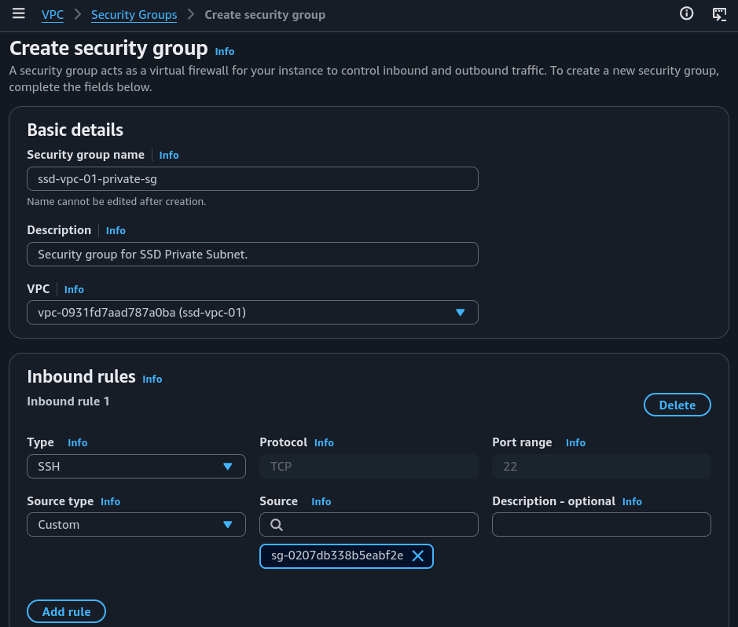
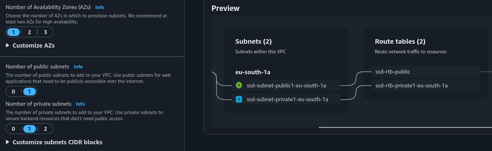
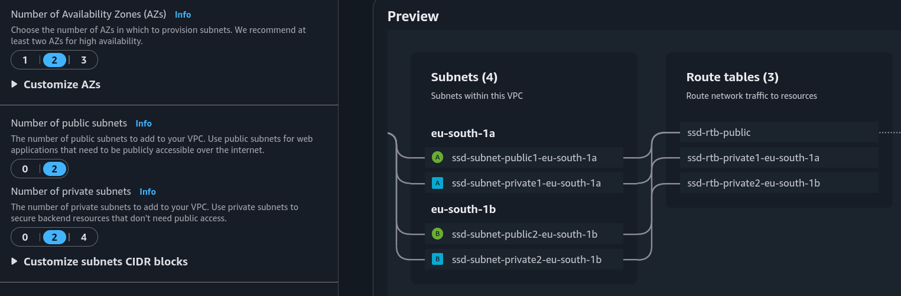
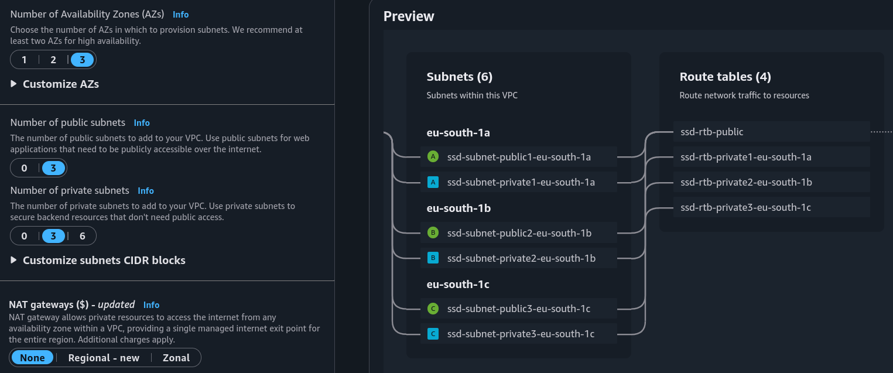
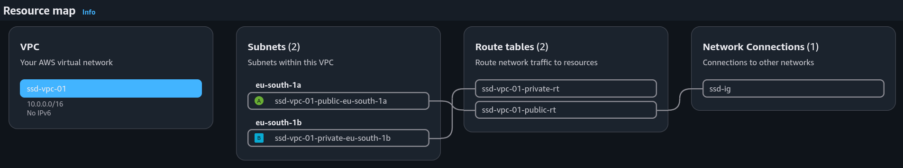

# Launch VPC Resources

## Project Overview
In this project, I used **Amazon VPC** to build an isolated virtual network with public and private subnets across multiple **Availability Zones**. **The goal** was to learn **how to design a secure, highly available network architecture.** To do this, I utilized the **"VPC and more"** visual resource map, set up custom **security groups** and **Network ACLs**, and explored components like **NAT gateways** to balance secure outbound internet access with strict inbound traffic controls.

### Key tools and concepts
* **Tools:** _AWS VPC, EC2._
* **Concepts Learnt:** _VPC, Subnets, Internet Gateway, Route Table, Network ACL._

### Introduction to Amazon VPC
**Amazon VPC** is the core networking tool for AWS. It lets us build our own separate networks, set up security and traffic rules, and control how our resources connect to the internet.

### How I used Amazon VPC in this project
I used **Amazon VPC** to build my own network. Inside it, I set up **EC2 instances** in both public and private subnets, and I added **security groups** and **network ACLs** to control the traffic.

### One thing I didn't expect in this project was...
I didn't expect the **resource map to be so visual and interactive.** It made the process of setting up and verifying all connected components both more convenient and faster. 

## Project Walkthrough

## 1. Launching a private server
My **private server** uses its own security group for safety. The public security group lets in all **HTTP traffic** from the internet, so using a separate security group for the private server keeps it safe from these outside risks.

<figure><figcaption></figcaption></figure>

My private server's security group's source is `ssd-vpc-01-private-sg`, which means only SSH traffic coming from resources associated with that security group would be allowed.

<figure><figcaption></figcaption></figure>

## 2. Speeding up VPC creation

### Creating a VPC with "VPC and More"
This time, I used an alternative way to set up an Amazon VPC. I used the **"VPC and more"** option, which gave me a VPC resource map to use when creating the VPC, including all of its components (security groups, rout tables, and internet gateways) all in a single interactive view.

### Understanding the VPC Resource Map
The **VPC resource map** is a **visual diagram** that displays all network components and the relationships between them. It's **interactive** and automatically highlights the specific connections for any resource I select/hover over.

### VPC CIDR Block Selection
**While separate VPCs are isolated** and can technically use identical IP ranges, **reusing blocks is not considered best practice** if I plan to implement VPC peering later on.

## 3. Network Design and Internet Connectivity

### Public Subnet Availability Zone Design
When configuring public subnets, the system limits the choice to either none or one per ****Availability Zone**. Placing **at least one subnet in each zone** follows the best practice for high availability and redundancy, **protecting the architecture from a single zone failure.**

<figure><figcaption></figcaption></figure>

<figure><figcaption></figcaption></figure>

<figure><figcaption></figcaption></figure>

### NAT Gateway Configuration
The set up page also included an option to create **NAT gateways**. This component allows resources in my private subnet to **get access to the internet** (e.g. for security updates) while still blocking off inbound traffic from the internet.

<figure><figcaption></figcaption></figure>
