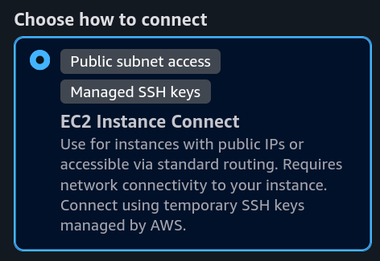
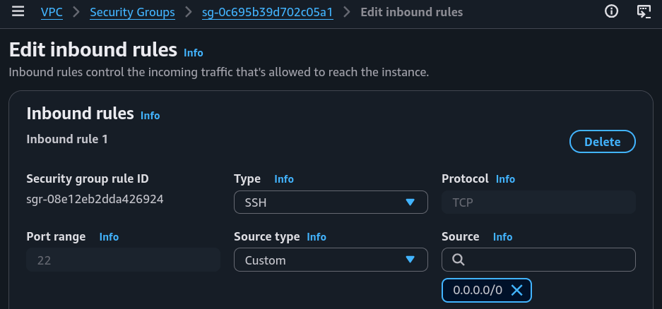
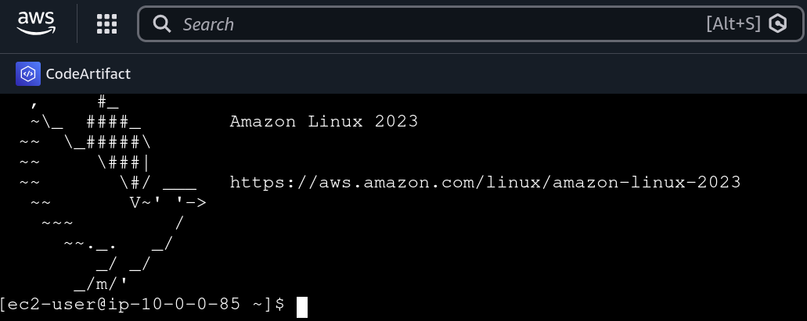
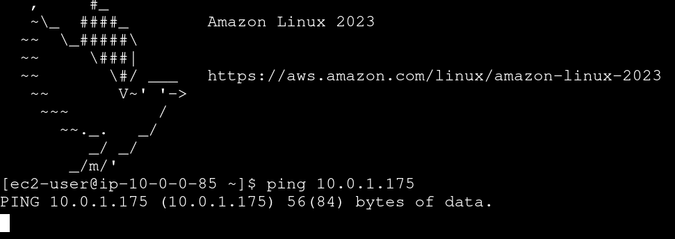
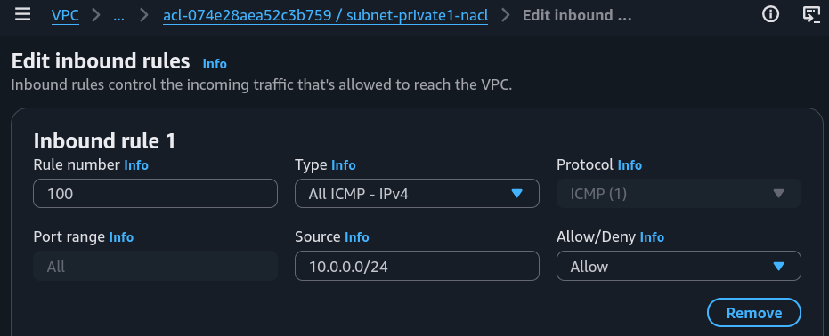
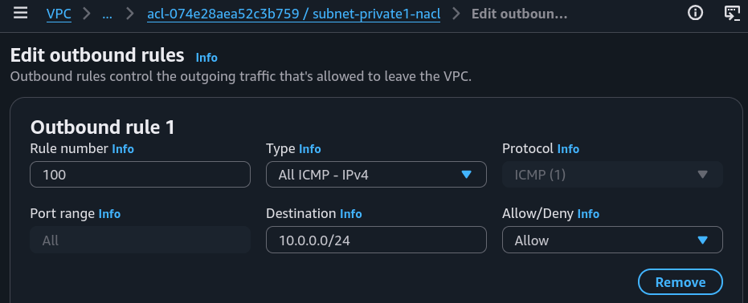
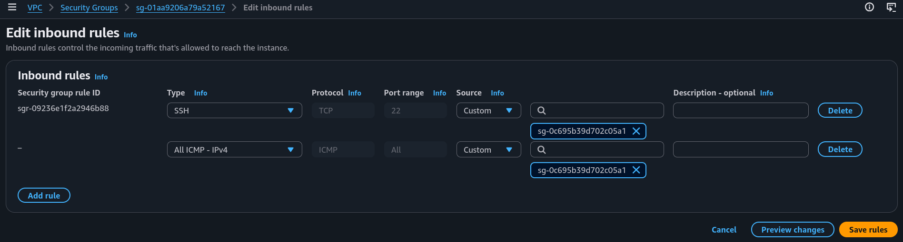
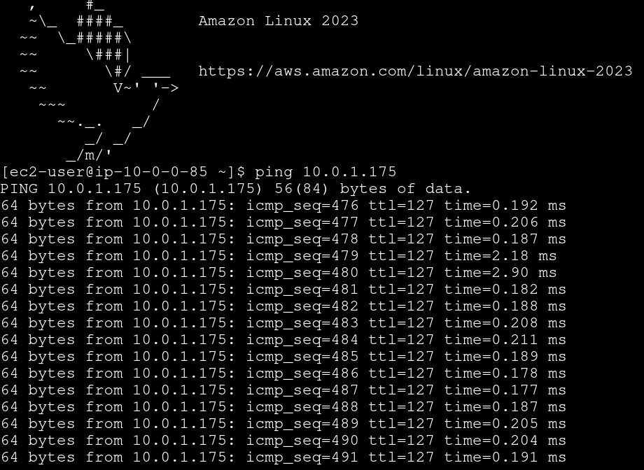
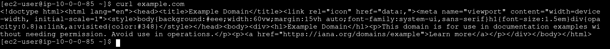

# Testing VPC Connectivity

## Project Overview
### How I used Amazon VPC in this project

In this project, I used **Amazon VPC** to set up a VPC and its components using the VPC wizard, and then **launched EC2 instances** (a Public and a Private servers). **The goal** was to **test connectivity between my network's resources,** by first connecting to my Public Server using SSH, then connect to my Private Server from it, and the internet as well.

### Key tools and concepts
* **Tools:** _AWS VPC, EC2, EC2 Instance Connect._
* **Concepts Learnt:** _VPC, Subnets, Internet Gateway, Route Table, Network ACL._

## Walkthrough
## 1. EC2 Connectivity

Connectivity is the **ability of different parts of a network to talk to each other and share data smoothly**. Without it, my systems cannot communicate, meaning users won't be able to open or use my application.

### EC2 Instance Connectivity

My first connectivity test was whether I could **connect to my network's Public Server** (an EC2 instance).

I connected to it using **EC2 Instance Connect**, which is a tool provided by Amazon EC2 that allows me to **directly access an EC2 instance using the AWS Management Console.** 

Also, this method allows me to **no longer need to manage key pairs or use an SSH client** to connect to my EC2 instance. Instead, these are all managed by AWS directly.

<figure><figcaption></figcaption></figure>

But, my first attempt actually **resulted in an error**.

<figure><figcaption></figcaption></figure>

This is because my Public Server had a **security group** that did not allow SSH traffic, it **only allowed HTTP traffic** i.e. a different protocol.

<figure><figcaption></figcaption></figure>

**To fix this error,** I added a **new inbound rule** in my Public Server's security group **that allows SSH traffic** from anywhere (allowing SSH traffic from **ALL IP addresses** is actually not the best idea, but this is just a learning scenario).

<figure><figcaption></figcaption></figure>

After that, I was finally able to connect.

<figure><figcaption></figcaption></figure>

## 2. Connectivity Between Servers

**Ping is a tool to test the connectivity between two servers** and also the response time (i.e. the performance of the connection). I used ping to test the connectivity between my Public and Private Servers.

I ran ping, followed by the private IPv4 address of my Private Server.

<figure><figcaption></figcaption></figure>

**The first ping returned NO replies from the Private Server.** This meant security settings with my private server was **blocking** inbound (and/or outbound) **ICMP traffic**, which is the traffic type of ping messages.

### Troubleshooting Connectivity

I troubleshooted this by **enabling ICMP traffic in my private server's network ACLs AND security group rules.** I also made sure the **Source/Destination** I defined in my network ACL correctly **pointed to my Public Subnet CIDR block.**

<figure><figcaption></figcaption></figure>

<figure><figcaption></figcaption></figure>

<figure><figcaption></figcaption></figure>

<figure><figcaption></figcaption></figure>

## 3. Connectivity to the Internet

**Curl** is a **connectivity tool that tests connectivity from a server to another server AND retrieves data from the target server too.**

I used curl to **test the connectivity between my Public Server with the public internet.** This test would only be succesful **IF** all the components in my network were set up correctly, which fortunately they were.

<figure><figcaption></figcaption></figure>

### Ping vs Curl

Ping and curl are different because they return different responses to my Public Server's terminal. **Ping responds with a report on the performance of connectivity** with my Private Server, **curl responded with HTML data** from another public server.
