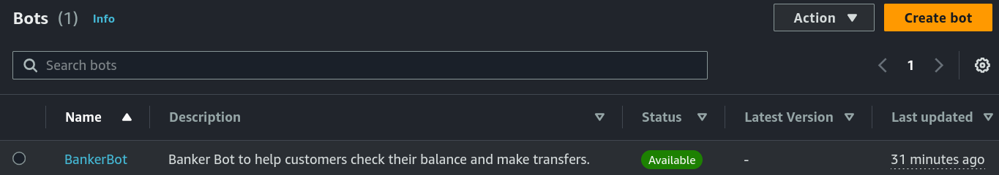
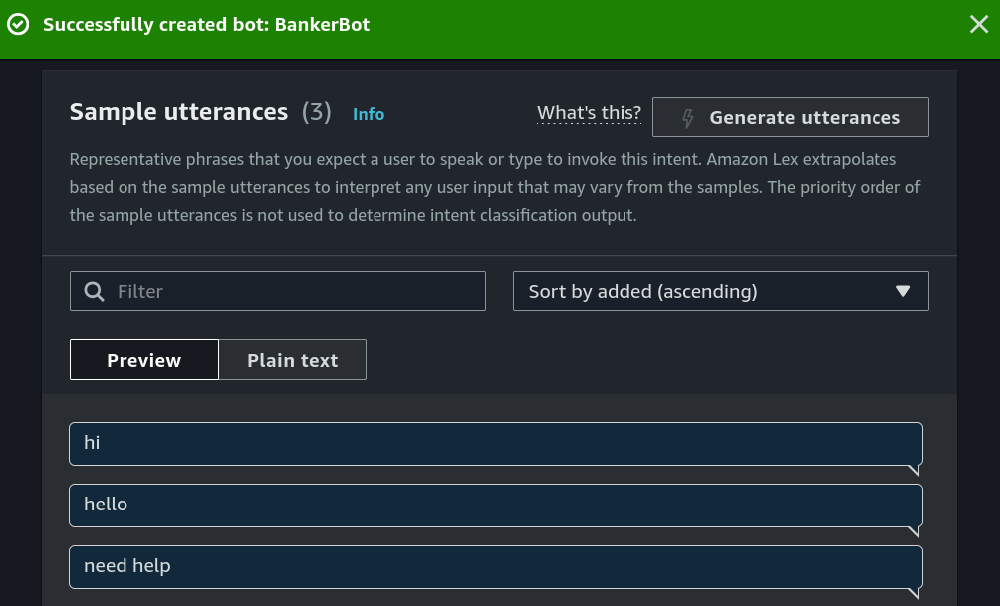
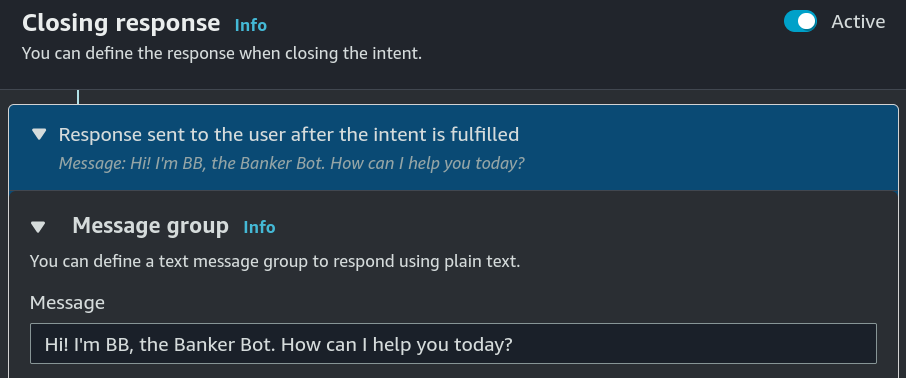
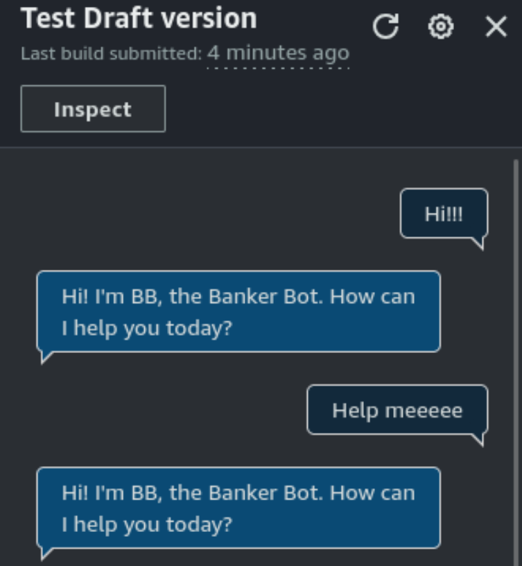
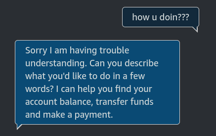
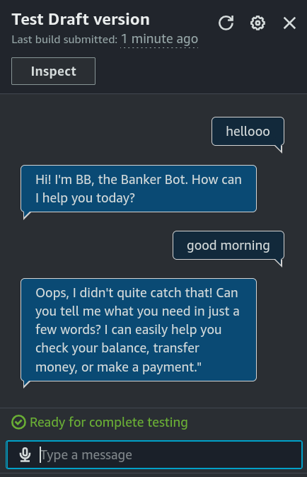

# Part 1: Build a Chatbot

## Project Overview
I am using **Amazon Lex** to create **BankerBot**, a chatbot assistant for a bank's clients, that they themselves can use e.g. for checking their bank balance or transferring money.

**In this first part**, I just worried about getting the chatbot to **greet the user and return an error message** when it doesn't understand the user's intent.

### What is Amazon Lex?
Amazon Lex is a tool that lets us **build voice and text chatbots.** It uses AI/ML capabilities to better undestand user intents.

### Key tools and concepts
* **Tools:** Amazon Lex.
* **Concepts Learnt:** Intents, Intent classification confidence score.

 

## Project Walkthrough

## 1. Setting up a Lex chatbot

<figure><figcaption></figcaption></figure>

### IAM Role Configuration
While setting up the chatbot, **I also created a role with basic permissions**, so that Amazon Lex will be able talk to other AWS services (e.g. AWS Lambda later in this project).

### Intent Classification Confidence Score
For the intent classification confidence score, **I kept the default value of 0.40.** This means that the chatbot **should at least be 40% confident that it understands what the user is asking, in order to give an answer.**
- If the value is set **too high**, the bot might be **overly hesitant**, and ask the user to clarify/repeat themselves, even though their request was fairly obvious.
- If the value is set **too low**, the bot might be **overly confident**, and execute stuff the user never actually asked for.

## 2. Intents

### Creating an Intent
**An Intent is what the user is trying to achieve in their conversation with the chatbot.** In Amazon Lex, we build a chatbot by defining and categorising different intents.

I created my first intent to be `WelcomeIntent`, which simply greets the user. **To do so, I defined utterances** (sample phrases) the chatbot should expect for this particular intent, **and its reponse to them.**

<figure><figcaption></figcaption></figure>

<figure><figcaption></figcaption></figure>

### Testing Chatbot Responses
I launched and tested my chatbot, which could respond successfully if I entered **similar utterances.**

<figure><figcaption></figcaption></figure>

However, here it returned the error message `'Intent FallbackIntent is fulfilled'`. This error message occurred because my **chatbot could not understand my intent** (the chatbot's confidence score was below 40%). 

<figure><figcaption></figcaption></figure>

## 3. FallbackIntent

### My FallbackIntent Configuration
For the FallbackIntent, I created a new closing response, since the default one wasn't really helpful. **It is good practice to respond with a message that can guide the user to be more more specific about their intent**, instead of just saying that their request didn't go through.

<figure><figcaption></figcaption></figure>

And also added **variations**, so that users won't get the same exact response every time.

<figure><figcaption></figcaption></figure>